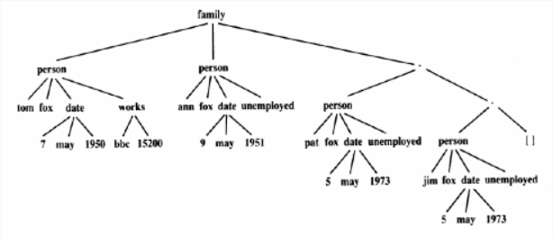

# Προαιρετική Εργασία 1
### Παραδοτέο είναι τεκμηριωμένος κώδικας και παράδειγμα σωστής εκτέλεσης σε ένα αρχείο pdf.
Έστω ότι ένα δημαρχείο έχει μία βάση γνώσης σε Prolog στην οποία αποθηκεύει πληροφορίες για τις οικογένειες που είναι εγγεγραμμένες στο δημοτολόγιό του. Το παρακάτω σχήμα δείχνει πως μπορούν να δομηθούν οι πληροφορίες για κάθε οικογένεια. Κάθε οικογένεια αποθηκεύεται σαν μία δήλωση. Προσέξτε ότι επειδή ο αριθμός τον παιδιών δεν είναι ο ίδιος για κάθε οικογένεια χρησιμοποιείται λίστα που μπορεί να χειριστεί οποιονδήποτε αριθμό παιδιών. (Κάποια ερωτήματα απαιτούν χρήση αριθμητικών τελεστών που παρουσιάζονται στη σελίδα 214 των διαφανειών.)
**Να αναπαρασταθεί η οικογένεια καθώς και 1-2 οικογένειες ακόμη (δική σας επιλογής) χρησιμοποιώντας το κατηγόρημα family/3 και κατάλληλους σύνθετους όρους.**

**(Για φοιτητές με επώνυμο από Π έως Τ):** Ορίστε τα κατηγορήματα exists/1, dateofbirth/2 και salary/2 και χρησιμοποιήστε τα για να ανακτήσετε όλους τους γονείς που γεννήθηκαν πριν το 1950 και ο μισθός τους είναι μικρότερος από 8000.