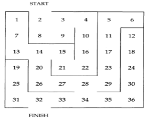

# Προαιρετική Εργασία 3
### 3η Εργασία (Παραδοτέο είναι pdf (όχι zip!) μέσω gunet2 με τεκμηριωμένο κώδικα και παράδειγμα εκτέλεσης).
**[Εναλλακτικό θέμα για φοιτητές με επώνυμο από Σ έως Ω γιατί το παραπάνω είναι αρκετά δύσκολο ;-) ]:** Υλοποιήστε πρόγραμμα που να βρίσκει το μονοπάτι εξόδου στον παρακάτω λαβύρινθο. Αναπαραστήστε το λαβύρινθο με γεγονότα της μορφής `connect(1, 7).` `connect(2, 8).` κλπ. Το μονοπάτι εξόδου θα είναι μία λίστα που θα έχει το start στην αριστερή άκρη και το finish στη δεξιά.

